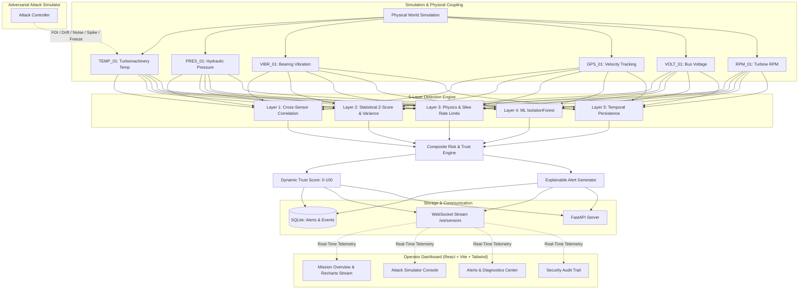

# SENTINEX – Intelligent Sensor Integrity Engine

[](https://fastapi.tiangolo.com)
[](https://react.dev)
[](https://vitejs.dev)
[](https://tailwindcss.com)
[](https://scikit-learn.org)
[](https://websockets.readthedocs.io)

---

## 1. Project Overview

**SENTINEX** is an industrial-grade cyber-physical sensor integrity and anomaly mitigation engine. It continuously monitors multi-modal physical sensor streams in critical infrastructure (such as turbomachinery, power grids, autonomous vehicles, and industrial SCADA plants), detects malicious falsification, sensor drift, noise, and physical violations, computes a real-time **Dynamic Trust Score (0–100)** for every sensor, publishes **explainable operator diagnostics**, and provides **active mitigation mechanisms** (down-weighting or isolating suspicious sensors from critical control loops).

---

## 2. Problem Statement

Modern critical infrastructure relies on automated sensor telemetry to make high-stakes operational decisions. However, sensors are vulnerable to:
1. **Cyber Attacks**: False Data Injection (FDI), replay attacks, and stealthy sensor drift.
2. **Physical Failures**: Open-circuit dropouts, flatlining/freezing, and mechanical vibration degradation.
3. **Environmental Interference**: High-variance electrical noise and electromagnetic transient spikes.

Traditional threshold monitoring either misses sophisticated coordinated manipulations or triggers false alarms. Furthermore, black-box anomaly detectors fail to explain *why* a sensor is compromised. **SENTINEX** resolves this by fusing five independent physics and statistical detection layers with explainable diagnostics and mitigation controls.

---

## 3. Key Features

- **6 Core Coupled Sensors**: Realistic simulation of Temperature, Pressure, Vibration, GPS Velocity, Voltage, and RPM with mutual physical coupling (e.g., RPM load drives shaft vibration and thermal expansion).
- **5-Layer Anomaly Detection Engine**:
  1. *Layer 1: Cross-Sensor Correlation* — Compares multi-sensor co-variances and fleet-wide consensus to identify nodes breaking physical correlation.
  2. *Layer 2: Statistical Detection* — Evaluates rolling moving average, standard deviation, variance collapse (freeze detection), and Z-score outlier boundaries.
  3. *Layer 3: Physics & Rule Consistency* — Validates operational envelope boundaries, absolute hard limits, and maximum physical slew rate limits ($d(\text{val})/dt$).
  4. *Layer 4: ML IsolationForest* — Multi-variate Scikit-learn unsupervised decision forest trained on coupled operational manifold distributions.
  5. *Layer 5: Temporal Analysis* — Measures anomaly duration and consecutive violation cycles to distinguish momentary noise glitches from sustained attacks.
- **Dynamic Trust Score (0–100)**:
  - **90–100 (Trusted)**: Nominal operational state (Green).
  - **60–89 (Warning)**: Minor anomalies or statistical variance warning (Yellow).
  - **30–59 (Suspicious)**: Cross-sensor divergence or physics breach (Orange).
  - **0–29 (Critical)**: Active malicious attack or structural sensor failure (Red).
  - *Gradual Recovery*: Once telemetry returns to normal, the trust score dynamically recovers toward 98%+.
- **Explainable Operator Alerts**: Natural-language root-cause diagnostic reports (e.g., *"Temperature-01 is suspicious because its reading (120.0°C) disagrees with 4 independent sensors for 3.2 seconds and violates the configured operating range"*).
- **Mitigation Control Actions**:
  - **DOWN-WEIGHT SENSOR**: Reduces sensor weight to 25% in voting logic while maintaining visibility.
  - **ISOLATE SENSOR**: Fully quarantines the compromised sensor. Displays: *"Sensor isolated. Trusted sensors continue supporting the system."*
  - **RESET SENSOR**: Restores sensor to nominal observation and initiates trust recovery.
- **Adversarial Attack Simulator**:
  - False Data Injection (FDI)
  - Sudden Value Manipulation
  - Sensor Drift (Stealth Bias)
  - Noise Injection
  - Sensor Failure (Freeze / Zero Drop)
- **1-Click Guided Demo Mode**: Automated 7-stage end-to-end demonstration tour with progress stepper designed for live presentations and judge evaluations.
- **Real-Time Dual-Protocol Telemetry**: Fast WebSocket streaming (`/ws/sensors`) updating every 1.0s with automatic HTTP polling fallback.

---

## 4. System Architecture



---

## 5. Tech Stack

### Frontend
- **React.js 19**
- **Vite 8**
- **Tailwind CSS v4** (Industrial Dark SOC Glassmorphism theme)
- **Recharts** (Real-time live telemetry curves with normal range reference bounds)
- **Lucide React** (Cybersecurity & telemetry iconography)

### Backend
- **Python 3.10+ / 3.12**
- **FastAPI** (REST API & high-concurrency WebSocket engine)
- **Uvicorn** (ASGI server)
- **NumPy & Pandas** (Sliding window and statistical calculations)
- **Scikit-learn** (`IsolationForest` multi-variate anomaly model)
- **WebSockets** (Real-time duplex communication)

### Database
- **SQLite3** (`sentinex.db` storing `alerts`, `sensor_events`, and `system_logs`)

---

## 6. Folder Structure

```text
Intelligent Sensor Integrity Engine/
├── backend/
│   ├── detection/
│   │   ├── __init__.py
│   │   ├── correlation.py      # Layer 1: Cross-Sensor Correlation
│   │   ├── statistical.py      # Layer 2: Statistical Z-Score & Moving Average
│   │   ├── physics.py          # Layer 3: Physics, Slew Rate & Operating Bounds
│   │   ├── ml_detector.py      # Layer 4: Scikit-learn IsolationForest Anomaly Model
│   │   ├── temporal.py         # Layer 5: Temporal Persistence & Duration
│   │   └── engine.py           # Combined Engine, Trust Scores & Explainable Alerts
│   ├── sensors/
│   │   ├── __init__.py
│   │   └── simulator.py        # 6 Coupled Sensors & Attack Simulation State Machine
│   ├── __init__.py
│   ├── config.py               # Sensor definitions, normal ranges & detection weights
│   ├── database.py             # SQLite schemas, alerts, events & audit logs
│   ├── demo_runner.py          # Guided 7-stage automated demonstration controller
│   └── main.py                 # FastAPI application, REST endpoints & WebSocket server
├── frontend/
│   ├── public/
│   ├── src/
│   │   ├── components/
│   │   │   ├── AlertDetailModal.jsx    # Diagnostic modal with operator mitigation
│   │   │   ├── DemoProgressBar.jsx     # Automated demo stepper banner
│   │   │   ├── LiveTelemetryChart.jsx  # Recharts live multi-sensor curves
│   │   │   ├── Navbar.jsx              # Status pill, live stream badge & quick actions
│   │   │   ├── SensorCard.jsx          # Individual sensor card with trust gauge
│   │   │   ├── SensorDetailModal.jsx   # 5-layer decomposition deep-dive modal
│   │   │   ├── Sidebar.jsx             # Navigation sidebar & layer legend
│   │   │   ├── StatusCard.jsx          # KPI metric cards
│   │   │   └── ToastContainer.jsx      # Cyber alert notification toasts
│   │   ├── hooks/
│   │   │   └── useTelemetry.js         # WebSocket client + fallback polling
│   │   ├── services/
│   │   │   └── api.js                  # REST endpoints and WebSocket URL helper
│   │   ├── views/
│   │   │   ├── AlertsView.jsx          # Alert center with severity/sensor filters
│   │   │   ├── AttackSimulatorView.jsx # Cyber attack injection chamber & presets
│   │   │   ├── DashboardView.jsx       # Mission overview & live sensor cards
│   │   │   ├── SensorsView.jsx         # Sensor inventory (Grid & Table views)
│   │   │   └── SystemLogsView.jsx      # Audit trail & security event log terminal
│   │   ├── App.jsx                     # Top-level application layout
│   │   ├── index.css                   # Tailwind v4, glassmorphism & cyber styling
│   │   └── main.jsx                    # React entry point
│   ├── package.json
│   └── vite.config.js                  # Vite configuration with proxy rules
├── .env.example                        # Environment variables template
├── requirements.txt                    # Python dependencies
└── README.md                           # Documentation
```

---

## 7. Installation & Setup

### Prerequisites
- Python 3.10, 3.12, or higher
- Node.js v18+ and npm

### Backend Setup
1. Open a terminal in the project root:
   ```bash
   py -3.12 -m venv venv
   # On Windows:
   .\venv\Scripts\activate
   # On macOS/Linux:
   source venv/bin/activate
   ```
2. Install Python packages:
   ```bash
   pip install -r requirements.txt
   ```

### Frontend Setup
1. In another terminal:
   ```bash
   cd frontend
   npm install
   ```

---

## 8. How to Run

### Step 1: Start the Backend Server
From the root directory with the virtual environment activated:
```bash
python -m uvicorn backend.main:app --host 0.0.0.0 --port 8000 --reload
```
*Backend will be running at `http://localhost:8000` (Swagger docs at `http://localhost:8000/docs`).*

### Step 2: Start the Frontend Application
In the `frontend` folder:
```bash
npm run dev
```
*Open your browser and navigate to `http://localhost:5173`.*

---

## 9. How to Demonstrate the Attack Scenario

The system supports both an **Automated Demo Mode** and a **Manual Operator Demonstration**:

### Option A: 1-Click Guided Demo (Recommended for Judges)
1. On the top navigation bar, click **"Demo Mode"**.
2. An interactive 7-stage progress bar will activate at the top:
   - **Stage 1 (Normal Operation)**: Baseline normal operation, all 6 sensors trusted, system status `SECURE`.
   - **Stage 2 (Attack Injection)**: Injects `False Data Injection (120.0°C)` on `TEMP_01`.
   - **Stage 3 (Detection Flagged)**: Cross-correlation, physics threshold, and Z-score anomalies trigger simultaneously.
   - **Stage 4 (Trust Score Drop)**: Trust score on `TEMP_01` plummets to `< 30%` (Critical); system status switches to `CRITICAL`.
   - **Stage 5 (Explainable Alert)**: Alert is generated explaining the physical and multi-sensor violation.
   - **Stage 6 (Sensor Isolation)**: `TEMP_01` is isolated from the voting loop. Banner confirms: *"Sensor isolated. Trusted sensors continue supporting the system."*
   - **Stage 7 (Recovery & Restore)**: Sensor is reset; trust score dynamically climbs back to `98%+`; system status returns to `SECURE`.

### Option B: Manual Operator Demonstration
1. Open the dashboard at `http://localhost:5173`. Confirm all 6 sensors show **TRUSTED** (green) and system status is **SECURE**.
2. Click **"Attack Simulator"** in the sidebar.
3. Select **Temperature (TEMP_01)**.
4. Select **False Data Injection**.
5. Set Manipulated Target Value to **`120`**.
6. Click **"Inject Attack"**.
7. Observe immediate changes:
   - Live temperature value spikes to ~120°C.
   - The real-time Recharts graph reflects the spike crossing the upper normal bound.
   - Anomaly score escalates toward `0.95+`.
   - Trust score drops into **CRITICAL** (red).
   - System status escalates to **CRITICAL**.
   - An alert appears with exact diagnostic reasons.
8. Click **"Inspect"** on `TEMP_01` to view the 5-layer decomposition.
9. Click **"ISOLATE SENSOR"**:
   - `TEMP_01` is flagged as **ISOLATED**.
   - A golden confirmation banner appears: *"Sensor isolated. Trusted sensors continue supporting the system."*
10. Click **"Reset Sensor"**:
    - The attack terminates.
    - Sensor returns to nominal ~72°C.
    - Trust score gradually recovers (+3.5% per second) until returning to **TRUSTED**.
    - System status returns to **SECURE**.

---

## 10. Example API Endpoints

| Method | Endpoint | Description |
|---|---|---|
| `GET` | `/api/system-status` | Returns system status, sensor counts, and active alert counts |
| `GET` | `/api/sensors` | Returns telemetry, trust scores, and status for all 6 sensors |
| `GET` | `/api/sensors/{sensor_id}` | Detailed telemetry and 5-layer detection breakdown for a single sensor |
| `GET` | `/api/alerts` | Filterable list of explainable alerts (`severity`, `sensor_id`, `status`) |
| `GET` | `/api/logs` | Security audit trail and mitigation logs |
| `POST` | `/api/attack/start` | Injects an attack (`sensor_id`, `attack_type`, `target_value`, `duration`) |
| `POST` | `/api/attack/stop` | Stops active attack on a sensor |
| `POST` | `/api/sensors/{id}/isolate` | Quarantines sensor from voting consensus |
| `POST` | `/api/sensors/{id}/downweight`| Reduces sensor weight to 25% |
| `POST` | `/api/sensors/{id}/reset` | Restores sensor and triggers gradual trust recovery |
| `POST` | `/api/system/reset` | Resets all sensors to baseline normal |
| `POST` | `/api/demo/start` | Initiates the 7-stage automated demo sequence |
| `POST` | `/api/demo/stop` | Halts the automated demo sequence |
| `WS` | `/ws/sensors` | WebSocket stream publishing live telemetry updates every 1.0s |

---

## 11. Future Enhancements

- **Hardware-in-the-Loop (HIL) Integration**: Connect physical CAN Bus, Modbus TCP, and MQTT industrial protocols.
- **Deep Autoencoder Anomaly Detection**: Complement IsolationForest with a LSTM or Transformer autoencoder for complex temporal sequence embeddings.
- **Automated Quarantine Playbooks**: Policy-based automatic isolation when consensus disagreement exceeds configurable risk thresholds.
- **Cryptographic Attestation**: Hardware root-of-trust (TPM / HSM) signing for verifiable sensor telemetry provenance.

---

## License
MIT License. Built for industrial cybersecurity research and demonstrative evaluation.
